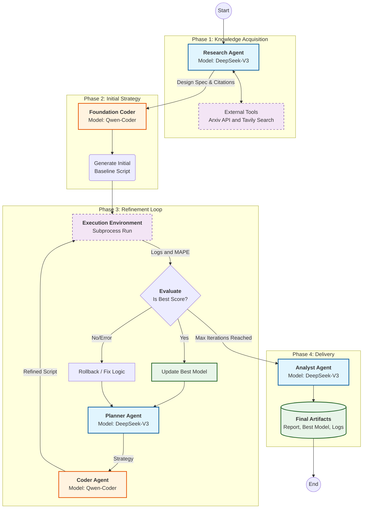

# MLE-STAR: Autonomous Machine Learning Optimization Agent
## 針對 Rossmann Store Sales 預測任務的自動化機器學習 AI Agent 系統
### 1. 專案概述 (Overview): 
MLE-STAR (Machine Learning Engineering Agent via Search and Targeted Refinement) 旨在全自動化機器學習流程。

而本專案針對 Rossmann Store Sales 資料集進行微調，透過整合 DeepSeek-V3 (Reasoner) 與 Qwen-Coder (Coder) 兩個大型語言模型，自主進行文獻探討、程式碼撰寫、模型訓練、錯誤修復以及超參數優化，最終產出最佳化的預測模型與分析報告。

#### 專案架構
```text
MLE-AI-AGENT/
├── outputs/
│   ├── analysis_report.md     # Analyst Agent 自動撰寫的完整分析報告
│   ├── final_best_model.py    # 經過多次迭代優化後，MAPE 最低的訓練程式碼
│   └── feature_importance.png
├── logs/                      # 用於追蹤 Agent 思考過程與 Debug
├── train_iter/                # 迭代過程的各版本程式碼
├── mle_star_agent.py          # 主要程式碼
└── requirements.txt
```

### 2. 核心架構與工作流: 


本系統採用 StateGraph 狀態機架構，包含四個主要節點：
1. Research Agent (Search Node)：
    - 搜尋學術論文 (Arxiv) 與 Kaggle 優勝方案 (Tavily Search)。
    - 目的：獲取針對時間序列預測與實體嵌入 (Entity Embeddings) 的最新技術與特徵工程策略。
    - 輸出：生成一份包含特徵工程與模型選擇的 Design Spec。
2. Foundation Coder (Foundation Node)：
    - 根據設計規範撰寫初代 Python 訓練腳本。
    - 安全防護：內建強制性規則（如過濾 Sales > 0、防止 Data Leakage），確保基礎程式碼的正確性。
    - 硬體感知：自動偵測 GPU 並配置 XGBoost/LightGBM 的加速參數
3. Refinement Loop (Refinement Node) - 核心:

    迭代優化的循環過程（預設 15 次迭代）：
    - 執行 (Execute)：執行所在的 Python 訓練腳本。
    - 評估 (Evaluate)：解析輸出 log，獲取 MAPE 分數與錯誤訊息。
    - 決策 (Planner Agent)：
        - 若失敗 (Error/Inf)：分析 Traceback 並提出修正方案。
        - 若成功但未提升：提出新的特徵工程策略（如 Log Transform, Lag Features）。
    - Rollback 機制：若新程式碼導致效能下降或崩潰，系統會自動回朔至上一個最佳版本。
    - 實作 (Coder Agent)：根據計畫修改程式碼。
4. Analyst Agent (Report Node)：
    - 在迭代結束後，彙整所有的實驗紀錄 (Experiment Log)。
    - 輸出：生成一份 Markdown 格式的總結報告，包含方法論、嘗試過的策略列表以及最佳 MAPE 成績。

### 3. 技術特點:
本專案特別針對面試挑戰的加分條件進行設計：

- 全本地/開源模型 (Bonus #2)：不依賴付費 Claude API，完全使用 DeepSeek 與 Qwen 透過 Ollama 執行，確保資料隱私與成本效益。

- 自主實作 Multi-Agent 架構 (Bonus #1, #3)：不使用現成的 Claude-flow，而是自行透過 LangGraph 構建狀態機。清晰定義 Research, Planner, Coder, Analyst 職責，並透過 Memory 共享上下文。

- 自我修復與優化 (Bonus #4, #5)：系統具備 "Refinement Logic" 與 Reward 機制，能從 錯誤中自主修正，並針對驗證集回饋 (MAPE) 動態調整特徵策略。

- 結構化日誌與引用 (Bonus #7)：透過 ExperimentLog 追蹤每一次迭代的策略、組件與結果，並自動標註該版本參考的文獻來源。

- 防退化機制 (Rollback)：具備版本控制概念，確保最終生成的程式碼是歷次迭代中表現最好的版本。

### 4. 環境需求與安裝:
可直接執行 ```pip install -r requirements.txt```
或手動安裝:
```bash
# Agent Framework
pip install langchain-core langchain-ollama langchain-community langgraph tavily-python arxiv dotenv tenacity
# Machine Learning
pip install pandas numpy scikit-learn xgboost lightgbm catboost matplotlib
```
API 配置請在專案根目錄建立 .env 檔案，填入以下資訊：
```.env
OLLAMA_API_KEY=your_ollama_key_here
TAVILY_API_KEY=your_tavily_key_here
```

#### 資料準備
請確保以下兩個檔案位於專案根目錄：
- train.csv (Rossmann 訓練資料)
- store.csv (店鋪資訊)

### 5. 使用說明 (Usage):
直接執行主程式即可啟動自動化流程：```python -m mle_star_agent```

執行過程監控系統會在 Console 輸出詳細的步驟：
- [Step 1] Research Agent: 顯示搜尋到的論文與 Kaggle 方案。
- [Step 2] MLE Coder: 生成基礎程式碼。
- [Step 3] Optimization Agent: 顯示每次迭代的 MAPE 分數與優化策略。
- [Step 4] Analyst Agent: 撰寫報告。

輸出產物
執行完成後，將生成以下檔案：
- final_best_model.py: 經過多次優化後，MAPE 分數最低的完整 Python 訓練腳本。
- analysis_report.md: 包含實驗歷程與洞察的完整分析報告。
- train_iter_X.py: (過程檔案) 各次迭代的臨時腳本。
- logs/: 詳細的執行日誌。

### 6. Configuration 可以在程式碼開頭調整以下參數：
- MAX_ITERATIONS: 預設為 15。增加此數值可讓 Agent 進行更深度的特徵工程探索。
- llm_reasoner: 目前設定為 deepseek-v3.1。
- llm_coder: 目前設定為 qwen3-coder。

### 7. 結果總結
本系統透過 MLE-STAR multi-agent 架構自動進行了 15 輪的假設驗證與程式碼優化，最終成功構建出 MAPE 為 9.07% 的銷售預測模型。

成果
- 最終驗證分數 (Final MAPE)：9.07%
- 效能提升關鍵：
    1. 目標變數對數轉換 (Log-Transform)：參考 citation，解決了銷售數據右偏問題，帶來最顯著的精度提升 (Iter 14)。
    2. 高階日曆特徵：引入 Kaggle 冠軍方案建議的「距離假期天數」、「學校假期」與「促銷序列」特徵 (Iter 6, 12)。
    3. 自我修復能力：系統在前 5 輪遭遇 LightGBM 參數錯誤導致 MAPE 為 Inf，Planner Agent 成功調整並修正。


### 8. References
- [Kaggle Datasets](https://www.kaggle.com/competitions/rossmann-store-sales/data) 
- [MLE-STAR: Machine Learning Engineering Agent via Search and Targeted Refinement](https://arxiv.org/pdf/2506.15692)