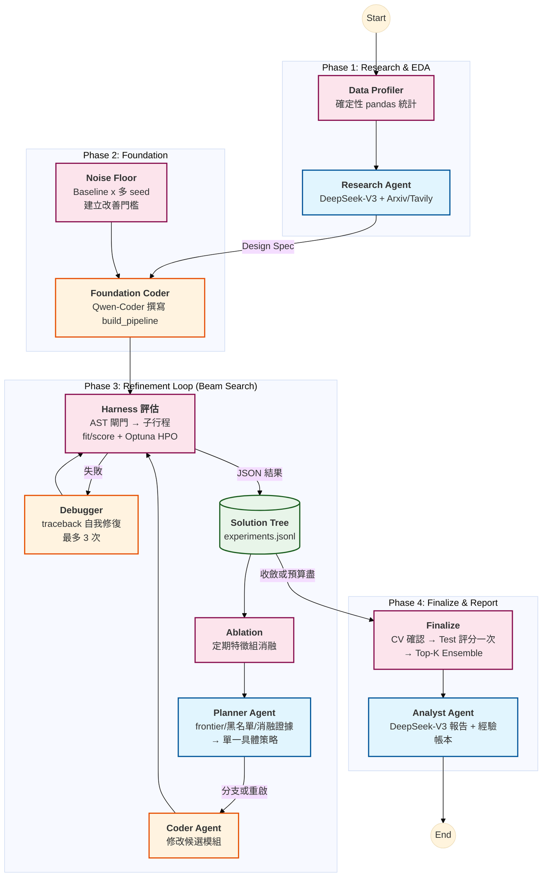

# MLE-STAR: Autonomous Machine Learning Optimization Agent
## 針對 Rossmann Store Sales 預測任務的自動化機器學習 AI Agent 系統

### 1. 專案概述 (Overview)

MLE-STAR (Machine Learning Engineering Agent via Search and Targeted Refinement) 是一套全自動化的機器學習工程系統：整合 DeepSeek-V3 (Reasoner) 與 Qwen-Coder (Coder) 兩個 LLM，自主完成資料剖析、文獻探討、模型程式撰寫、錯誤修復、超參數優化與報告產出。

**v2.0 的核心設計哲學：「Harness is law; prompts are suggestions.」**
所有與正確性相關的環節（資料切分、特徵的時序紀律、評分）皆由確定性的 Harness 程式碼掌控，LLM 只負責「設計」——這使得回報的分數**結構上不可能被洩漏**（v1 曾因 LLM 自行撰寫評分程式而產出 <1% 的虛假 MAPE）。

#### 專案架構
```text
MLE_star_agent/
├── mle_star/                  # 主套件
│   ├── config.py              #   參數、路徑、預算、seed
│   ├── data.py                #   載入、強制不變量、時序特徵、三段式切分
│   ├── profiling.py           #   (B1) 確定性 EDA 剖析
│   ├── harness.py             #   候選評估：AST/政策閘門、子行程、記憶體看門狗
│   ├── runner.py              #   子行程：seed、fit/predict/score、JSON 結果
│   ├── baseline_candidate.py  #   Harness 自有的基準模型（noise floor + 合約範例）
│   ├── llm.py                 #   LLM 客戶端、重試、token 帳本
│   ├── prompts.py             #   所有 prompt 模板
│   ├── store.py               #   (D3) 實驗存儲 / solution tree / checkpoint
│   ├── agents.py              #   LangGraph 節點：research/foundation/refine/finalize/report
│   └── graph.py               #   流程圖接線
├── test/test_system.py        # 無需 LLM 的煙霧測試（8 項）
├── outputs/                   # 交付物：最佳模型、報告、experiments.jsonl
├── train_iter/                # （執行期）各候選模組
├── REFACTOR_PLAN.md           # v2 架構規格書（A1-E 條目編號出處）
└── requirements.txt
```

### 2. 核心架構與工作流


```mermaid
%%{init: {'theme': 'base', 'themeVariables': { 'fontSize': '16px', 'fontFamily': 'arial' }}}%%
graph TD
    classDef reasoner fill:#e1f5fe,stroke:#01579b,stroke-width:2px;
    classDef coder fill:#fff3e0,stroke:#e65100,stroke-width:2px;
    classDef harness fill:#fce4ec,stroke:#880e4f,stroke-width:2px;
    classDef storage fill:#e8f5e9,stroke:#1b5e20,stroke-width:2px;

    Start((Start)) --> Profile

    subgraph "Phase 1: Research & EDA"
        Profile[<b>Data Profiler</b><br/>確定性 pandas 統計]:::harness
        Research[<b>Research Agent</b><br/>DeepSeek-V3 + Arxiv/Tavily]:::reasoner
        Profile --> Research
    end

    Research -->|Design Spec| Foundation

    subgraph "Phase 2: Foundation"
        Noise[<b>Noise Floor</b><br/>Baseline x 多 seed<br/>建立改善門檻]:::harness
        Foundation[<b>Foundation Coder</b><br/>Qwen-Coder 撰寫 build_pipeline]:::coder
        Noise --> Foundation
    end

    Foundation --> Evaluate

    subgraph "Phase 3: Refinement Loop (Beam Search)"
        Evaluate[<b>Harness 評估</b><br/>AST 閘門 → 子行程<br/>fit/score + Optuna HPO]:::harness
        Evaluate -->|失敗| Debugger[<b>Debugger</b><br/>traceback 自我修復<br/>最多 3 次]:::coder
        Debugger --> Evaluate
        Evaluate -->|JSON 結果| Tree[(<b>Solution Tree</b><br/>experiments.jsonl)]:::storage
        Tree --> Ablation[<b>Ablation</b><br/>定期特徵組消融]:::harness
        Ablation --> Planner[<b>Planner Agent</b><br/>frontier/黑名單/消融證據<br/>→ 單一具體策略]:::reasoner
        Planner -->|分支或重啟| Coder[<b>Coder Agent</b><br/>修改候選模組]:::coder
        Coder --> Evaluate
    end

    Tree -->|收斂或預算盡| Finalize

    subgraph "Phase 4: Finalize & Report"
        Finalize[<b>Finalize</b><br/>CV 確認 → Test 評分一次<br/>→ Top-K Ensemble]:::harness
        Analyst[<b>Analyst Agent</b><br/>DeepSeek-V3 報告 + 經驗帳本]:::reasoner
        Finalize --> Analyst
    end

    Analyst --> End((End))
```

#### 五個階段
1. **Research & EDA (B1/B7)**：Harness 以 pandas 計算真實資料剖析（缺失、偏態、洩漏候選欄位），LLM 只負責「解讀」；同時檢索論文 (Arxiv) 與 Kaggle 解法（含程式碼片段，僅作靈感、絕不執行）。
2. **Foundation (A3)**：先以多組 seed 執行基準模型估計 **noise floor**——之後任何「改善」必須超過 `max(0.05, 2σ)` 才算數，避免 Planner 追逐雜訊。接著由 Coder 撰寫第一個候選模組。
3. **Refinement Loop (B2/B3/B4/C1)**：每輪 = Harness 評估（含 Optuna 數值調參）→ 失敗則進入專職 Debug 迴圈 → 節點寫入 solution tree → Planner 依據 frontier、策略黑名單、消融證據與遙測（時間/記憶體）決定**單一**下個實驗，可從任一有望節點分支，停滯時強制重啟。
4. **Finalize (A2/B5/B6)**：Top-K 候選以 expanding-window CV 確認 → **test set（最後 42 天）只評分一次** → 以驗證集權重混合 Ensemble。
5. **Report (D4)**：Analyst 產出含誠實評估協議說明的報告，並將本次經驗寫入 `learned_lessons.md` 供未來執行參考。

### 3. 誠實評估協議 (Honest Evaluation) — v2 的根本差異

| 機制 | 實作 |
|---|---|
| 候選合約 (A1) | LLM 只回傳**未擬合**的 sklearn Pipeline；Harness 負責 fit/predict/score，可擬合的轉換因此「結構上」只能 fit 在訓練集 |
| 三段式時序切分 (A2) | train / validation（驅動所有決策）/ test（最後 42 天，**整個流程只評分一次**） |
| 時序特徵紀律 | 所有 lag/rolling 位移 ≥ 42 天（= 預測視野），val/test 列不可能看到自身區段的銷售 |
| Target encoding | 只 fit 在 `val_start − 84 天` 之前的資料，於 holdout 與 CV 兩種模式皆誠實 |
| 洩漏欄位 | `Customers`（預測時不存在）由 Harness 硬性排除，LLM 無從使用 |
| 確定性 (A3) | 子行程強制 seed；同 seed 分數完全一致（測試斷言至 1e-9） |
| 指標 (A4/A5) | Harness 以 JSON 回傳 MAPE+RMSPE（可插拔），完全移除 v1 的 stdout 正則解析 |

**誠實基準**：baseline 約 **MAPE 8.2% / RMSPE 10.9%**（holdout）。若任何候選回報 MAPE < 2%，應先懷疑洩漏而非慶祝。

### 4. 環境需求與安裝

Python **3.13**。

```bash
pip install -r requirements.txt
```

`.env`（專案根目錄）：
```
OLLAMA_API_KEY=your_ollama_key_here
TAVILY_API_KEY=your_tavily_key_here   # 選填；缺少時略過網路檢索
```

資料：將 `train.csv` 與 `store.csv` 置於專案根目錄（[Kaggle Rossmann](https://www.kaggle.com/competitions/rossmann-store-sales/data)）。

### 5. 使用說明 (Usage)

```bash
python -m mle_star                 # 完整執行
python -m mle_star --max-iter 5    # 短程驗證
python -m mle_star --resume        # 從 checkpoint 續跑 (C3)
python -m mle_star --force-data    # 重建資料快取
python test/test_system.py         # 煙霧測試（無需 LLM 金鑰）
```

輸出產物（`outputs/`）：
- `final_best_model.py`：最佳候選模組（build_pipeline 合約）
- `analysis_report.md`：含誠實評估協議說明的完整報告
- `final_results.json`：val/CV/test 分數、ensemble 權重、token 用量
- `experiments.jsonl`：每個候選節點的完整結構化紀錄（取代 v1 的 .log 解析）

### 6. Configuration

主要參數集中於 `mle_star/config.py`，部分支援環境變數覆寫：

| 參數 | 預設 | 說明 |
|---|---|---|
| `MAX_ITERATIONS` / `MLE_STAR_MAX_ITER` | 20 | 精煉迴圈上限 |
| `METRIC` / `MLE_STAR_METRIC` | mape | 選擇指標（mape / rmspe） |
| `BEAM_WIDTH` | 3 | frontier 寬度 |
| `PATIENCE` | 6 | 連續未改善即提前停止 |
| `OPTUNA_TRIALS_FAST` | 15 | 每候選的數值調參預算 |
| `TOKEN_BUDGET` / `MLE_STAR_TOKEN_BUDGET` | 2,000,000 | token 預算，超過即優雅終止 |
| `MEMORY_LIMIT_MB` / `EXEC_TIMEOUT_S` | 8000 / 900 | 硬性資源上限（看門狗直接 kill） |

### 7. 技術特點

- **全開源模型**：DeepSeek-V3 + Qwen-Coder（Ollama Cloud），不依賴付費 Claude API。
- **自主實作 Multi-Agent 架構**：以 LangGraph 構建狀態機，職責清晰（Profiler / Research / Foundation / Debugger / Planner / Coder / Analyst），以 solution tree 共享上下文。
- **自我修復**：專職 Debug 迴圈（traceback 萃取 + 錯誤驅動檢索），與「改善」迴圈分離，壞程式不消耗優化迭代。
- **證據驅動的優化**：Planner 收到的是 ablation 消融數據、遙測與黑名單，而非僅憑想像猜「最弱組件」。
- **防退化與防雜訊**：solution tree 永遠從最佳節點分支；改善需超過實測 noise floor 才被承認。
- **可恢復、可預算**：checkpoint/`--resume`、token 與 wall-clock 預算、記憶體看門狗。
- **結構化實驗紀錄**：`experiments.jsonl` 同時支撐 beam search、消融證據、續跑與最終報告。

### 8. 版本歷史

- **v2.0**（本版）：依 `REFACTOR_PLAN.md` 重構為套件；誠實評估（harness-owned split/metric/features）、beam search、Optuna、ensemble、debug 迴圈、確定性與預算控管。v1 的 <1% MAPE 經查為資料洩漏，v2 以架構層面根除。
- **v1.0**：單檔 `mle_star_agent.py`，LLM 撰寫完整訓練腳本、以 stdout 正則解析 MAPE。歷史紀錄見 git 歷史與 `train_iter/` 早期提交。

### 9. References
- [MLE-STAR: Machine Learning Engineering Agent via Search and Targeted Refinement (arxiv:2506.15692)](https://arxiv.org/pdf/2506.15692)
- [Kaggle Rossmann Store Sales](https://www.kaggle.com/competitions/rossmann-store-sales/data)
